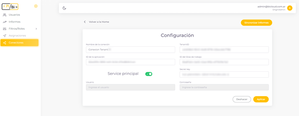
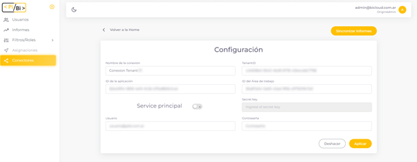
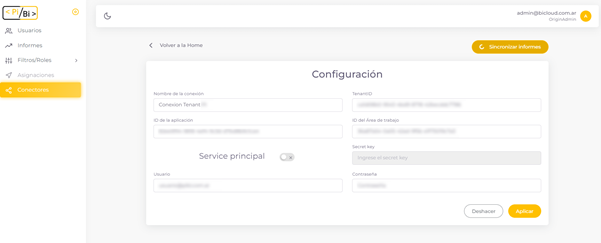

# ¿Qué es un conector en PiBi? 

Un conector es una configuración que nos va a permitir acceder a los reportes de Power BI. En PiBi debemos completar la información del conector para indicar en qué Tenant y grupo de trabajo se encuentran dichos reportes.  

Para validar nuestros permisos de acceso a estos informes podemos elegir entre dos tipos de conexión. Uno de ellos se llama Service Principal y consiste en indicarle al conector el *Id de la aplicación* y el Secret Key. Estos códigos los obtenemos creando una *App Registration en Azure*. 

La otra opción de acceso es *Master User* en la cual debemos ingresar un usuario y contraseña. Lo particular es que este usuario debe tener permisos de administrador en Power BI al que nos estamos conectando y permisos sobre la App registrada. 

Cuando completamos los datos y pulsamos en el botón *Aplicar* se guardará el conector e intentará conectarse al espacio de trabajo de Power BI con los datos ingresados. Un mensaje indicará si la conexión fue exitosa u ocurrió algún problema. 

# Sincronizar Informes 

Luego de tener configurado nuestro conector vamos a poder sincronizar la lista de informes de PiBi con los datos que se encuentran compartidos en el espacio de trabajo de Power BI. 

Cuando pulsemos en *Sincronizar Informes*, PiBi buscará los informes compartidos en Power Bi y actualizará su base de informes. Luego se aplicará el rol de seguridad *Administrador* para todos los usuarios administradores de PiBi y para todos los informes recientemente sincronizados. De manera que los usuarios administradores de PiBi siempre podrán consultar la información de los informes. 

Además, PiBI cuenta con dos sincronizaciones automáticas por día las cuales mantienen actualizados los informes. 