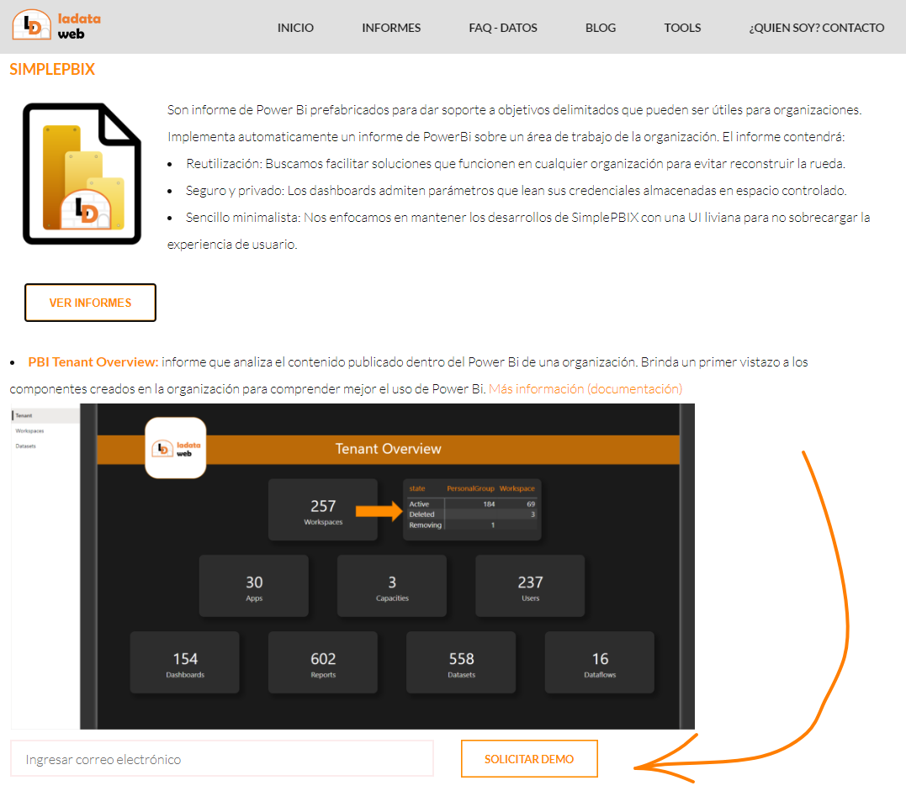
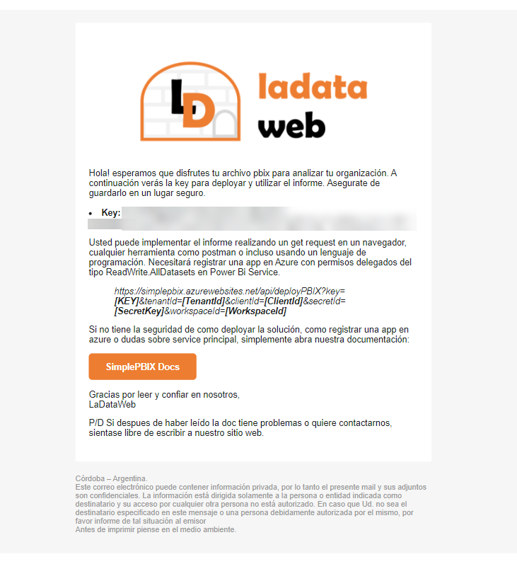

# ¿Cómo implementar un informe SimplePBIX en mi Power Bi Service? 

Una vez que tengamos creada la App necesaria para el deploy, procedemos a hacer la petición del archivo en el sitio: <a href="https://www.ladataweb.com.ar/tools">https://www.ladataweb.com.ar/tools</a>
Expandimos en la sección SimplePBIX y solicitamos una Demo ingresando un correo electrónico.

## ¿Por qué un correo?

El correo será necesario para que podamos proveer una clave de acceso para la implementación. En dicha dirección recibirá un correo con instrucciones de una Rest API que solicitará los siguientes parámetros:
- *Key de SimplePBIX*: key recibida por correo para acceder al informe
- *TenantId*: id de la organización que se puede obtener en el recurso Azure Active Directory
- *ClientId*: id de la aplicación registrada para implementación
- *SecretId*: secreto de la aplicación generado para autenticar
- *WorkspaceId*: id del area de trabajo en la cual deseamos implementar el informe de SimplePBIX.

Ejemplo del correo:

	
>*NOTA: recuerde que este aplicación tiene un solo permiso en una sola area de trabajo. No hay peligros de filtrado de datos ni seguridad de acceso. Para mayor seguridad recomendamos borrar el secreto al finalizar la implementación.*
	
## Deploy

La implementación puede ejecutarla con cualquier lenguaje de programación, postman o el mismo navegador completando los parametros deseados. En caso que alguna configuración de permisos no esté correctamente definida, lea atentamente el error anunciado para corregirlo o comuníquese con nosotros para que podamos brindar asistencia.