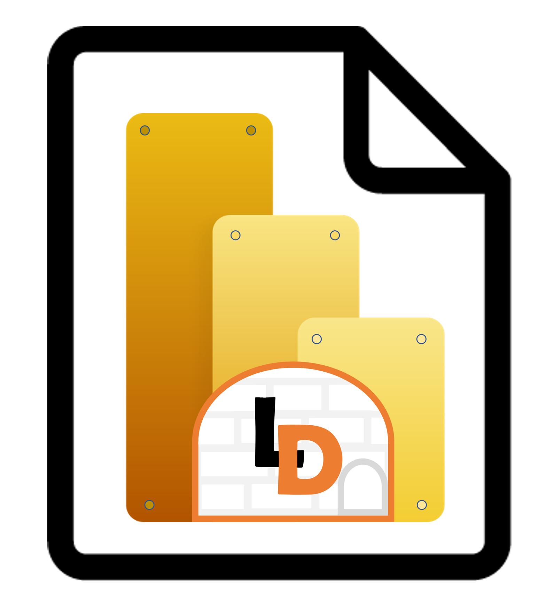

# Guía 
Les damos la bienvenida a los docs de SimplePBIX.

## ¿Qué es SimplePBIX?
- **Sección de soluciones**: SimplePBIX es una sección de archivos pbix autodeployables enfocados en una solución como showcase.
- **Implementación sin intervención externa​**: los archivos .pbix son pueden implementarse automaticamente en nuestro PowerBi Service.​
- **Actualizaciones programadas​**: Permite mantener los informes actualizados con tan solo cambiar los parametros según indicaciones​.

## ¿Por qué?
- **Reutilización**: Buscamos facilitar soluciones que funcionen en cualquier implementación de data para evitar reconstruir la rueda.​
- ​**Seguro y privado​**: Los dashboards admiten parámetros que lean sus credenciales almacenadas en otra parte para no quedar al descubierto.​
- **Sencillo minimalista​**: Nos enfocamos en mantener los desarrollos de SimplePBIX con una UI liviana para no sobrecargar la experiencia de usuario.​

## Características Principales
- Reduce tiempo de desarrollo.
- Reduce tiempo de implementación.
- Implementación directa en producción.​
- Cambio de origen de datos por parámetros
- Seguridad de credenciales sensibles por archivos internos para garantizar su seguridad.
- Nunca pediremos para implementar una cuenta administradora con privilegios totales.​